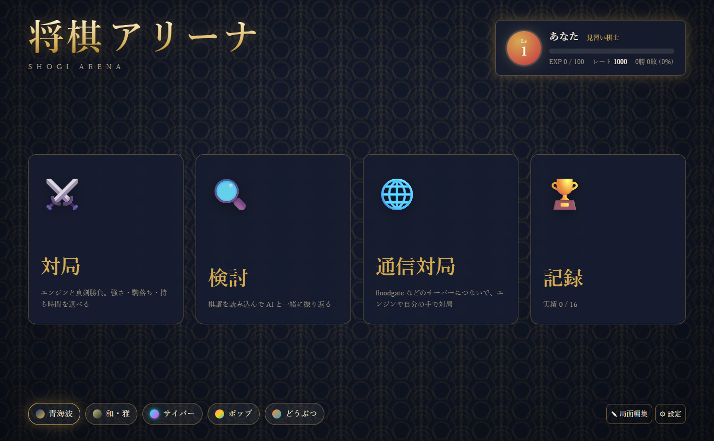
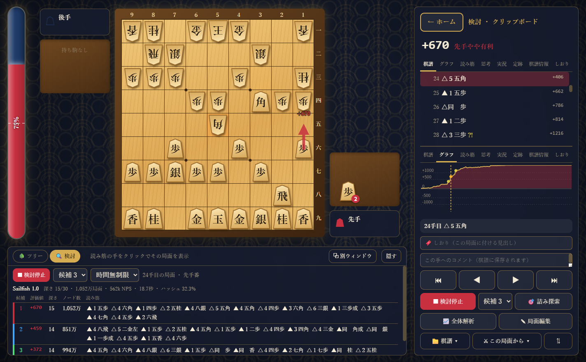
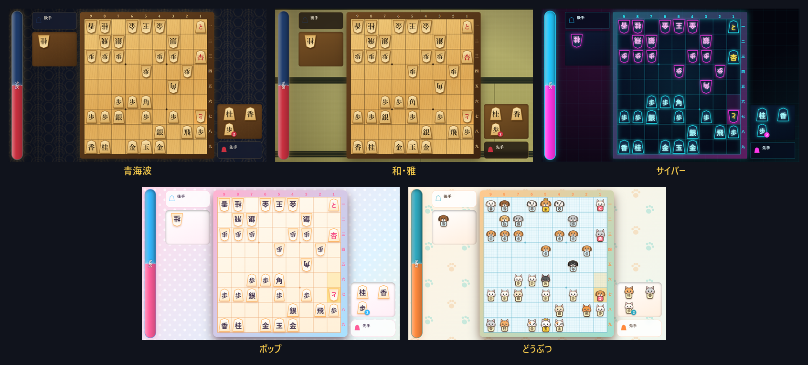

# 将棋アリーナ (Shogi Arena)

ゲームのように遊べる将棋 GUI。USI エンジン（Sailfish、水匠、やねうら王 など）に対応した Windows 用のデスクトップアプリです。
エンジンとの対局、AI と一緒の検討、floodgate での通信対局まで、これ 1 つで楽しめます。

**[⬇ 最新版をダウンロード](../../releases/latest)**（無料・Windows 10 / 11） ／ [紹介サイト](https://goro0803-droid.github.io/shogi-arena/)



### 検討画面
評価値グラフ、候補手の矢印、複数の読み筋、悪手の判定、分岐ツリーで対局を振り返れます。



### 5 つのテーマ
見た目はいつでも切り替えられます。どうぶつテーマでは、先手が猫・後手が犬の駒になります。



## インストール（Windows 10 / 11, 64bit）

[Releases](../../releases/latest) から次のどちらかをダウンロードしてください。

- `ShogiArena-Setup-<バージョン>.exe` … インストーラー（スタートメニューとデスクトップにショートカットができます）
- `ShogiArena-<バージョン>-win-x64.zip` … インストール不要版（解凍して `Shogi Arena.exe` を起動）

将棋エンジン **Sailfish 1.0** が同梱されていて、初回起動時に自動で登録されます。
他のエンジン（水匠、やねうら王 など）は「設定 → エンジンを追加」から登録できます。

> 初回起動時に Windows の「PC を保護しました」という画面が出た場合は、
> 「詳細情報」→「実行」を押してください（コード署名をしていないために表示されます）。

## 開発

```
npm install
npm start       # 起動（隣の ../Sailfish/target/release/sailfish.exe を自動で登録）
npm run dist    # 配布用のインストーラーと zip を dist/ に作る
```

## 機能

| モード | 内容 |
|---|---|
| 対局 | エンジンと対局。強さ 6 段階、駒落ち 10 種、指定局面から開始、持ち時間・秒読み・加算・切れ負け（カスタム可）、振り駒、待った・ヒント・すぐ指させる |
| 検討 | 候補手の複数表示（MultiPV）と矢印、読み筋の盤面再生、詰み探索（エンジン非対応時は内蔵ソルバー）、全体解析で悪手・疑問手を検出、棋譜コメント |
| 局面編集 | 駒箱・持ち駒の編集、右クリックで成り／先後切替、平手・詰将棋用プリセット、編集局面から検討・対局・観戦 |
| 記録 | 経験値・レベル・称号・レート、強さ別成績、対局履歴、実績 18 種 |

### 棋譜

- 読み込み：KIF / KI2 / CSA / SFEN / USI（ファイル・クリップボード・Ctrl+V）。KIF の局面図（BOD）とコメントにも対応
- 書き出し：KIF / KI2 / CSA / USI（保存時の拡張子で形式を選択）、クリップボードへのコピー（Ctrl+C は KIF）
- 同じ升に複数の駒が動ける場合は「右・左・上・引・寄・直」で表記

- 変化（分岐）：検討中に別の手を指すと元の手順を残したまま変化として追加。棋譜の「+N」印、「次の手の変化」パネルで切り替え・本譜にする・削除。KIF の「変化：N手」の読み書きに対応
- 将棋ウォーズ：ウォーズの棋譜画面で KIF をコピーし、クリップボードから読み込み（検討画面の「📥 ウォーズ」に手順あり）

### 通信対局（CSA サーバー / floodgate）

- ホームの「🌐 通信対局」から、floodgate（wdoor.c.u-tokyo.ac.jp:4081）または任意の CSA サーバーに接続
- floodgate ではログイン名・対局の種類（5分/10分 + 10秒加算）・トリップを入力。組み合わせは毎時 00 分と 30 分
- 指し手は登録エンジン（または自分）。エンジンの評価値・読み筋を floodgate 形式のコメントで送信
- 通信の遅れを見込み、エンジンに渡す持ち時間を 1 秒少なくする。時間切れ・千日手などの判定はサーバーが行う
- 「終局したら次の対局を自動で待つ」で連続参加

### 定跡

- 局面ごとに指し手・回数（採用の重み）・評価値・コメントを登録（右パネルの「定跡」タブ）
- 棋譜の手順をまとめて登録、やねうら王形式（.db）の読み込み・書き出し
- 対局・観戦で「定跡を使わせる」をオンにすると、登録された手から重みに応じて選んで指す
- 保存先：`%APPDATA%\shogi-arena\book.json`

### 画面と表示

- 右パネルは上下 2 段のタブ（棋譜・グラフ・読み筋・思考・実況・定跡・棋譜情報・しおり）。どちらに何を出すか選べ、境界はドラッグで調整
- 悪手判定は期待勝率の損失で 4 段階（緩手 5% / 疑問手 10% / 悪手 20% / 大悪手 50%、係数 600。設定で変更可）
- 評価値の向き（先手から／手番側から）、矢印の最大数・最善手との差・矢印への評価値表示
- 読み筋の再生中に「変化に追加」「コメントに追加」、検討時間の上限（秒）
- しおり（KIF の `&` 行）、棋譜情報（棋戦・日時・場所・持ち時間）、棋譜欄の消費時間
- 対局後の棋譜自動保存（フォルダとファイル名のひな形）
- 書籍風の局面図を PNG 保存・コピー
- 駒の文字（一文字／二文字）、盤（テーマ・榧・本榧・白・緑・画像ファイル）、駒台の画像
- 棋譜ファイルのドラッグ＆ドロップ

### その他

- 盤面の画像コピー（Ctrl+Shift+C）・PNG 保存
- 複数エンジンでの同時検討（設定の「同時検討」で最大 3 つ追加。メインと合わせて 4 つ）。同時検討エンジンの候補数は「サブ候補」で 1〜5

- エンジン設定：登録したエンジンの USI オプション（Threads・USI_Hash・EvalDir など）を画面から編集
- 指し手の読み上げ（設定で ON）、マウスホイールで棋譜の前後移動

テーマは「青海波」「和・雅」「サイバー」「ポップ」「どうぶつ」の 5 種類（どうぶつは先手が猫・後手が犬のオリジナルイラストの駒）。駒音や王手のカットイン、駒取り・成りのエフェクトもテーマごとに変わります。

## 構成

| ファイル | 内容 |
|---|---|
| `main.js` / `preload.js` | Electron 本体。USI エンジンのプロセス管理、ファイル入出力、設定の保存 |
| `src/js/shogi.js` | 将棋のルール（合法手・SFEN・USI 表記） |
| `src/js/kifu.js` | 日本語の指し手表記、KIF の読み書き |
| `src/js/engine.js` | USI プロトコル通信（ブラウザでは簡易 AI） |
| `src/js/board-view.js` | 盤・駒台の描画と操作、アニメーション |
| `src/js/app.js` | 画面遷移と対局・検討・観戦の進行 |
| `src/js/effects.js` | 効果音（WebAudio 合成）・パーティクル・カットイン |
| `src/js/progress.js` | 経験値・レート・実績 |
| `src/js/commentary.js` | 実況コメント生成 |
| `src/css/style.css` | 画面デザインと 3 テーマ |

設定と戦績は `%APPDATA%\shogi-arena\store.json` に保存されます。

## 画面だけ確認する（ブラウザ）

```
python -m http.server 5173 --directory src
```

`http://localhost:5173` を開くと、内蔵の簡易 AI を相手に画面を試せます。

## ライセンス

MIT License © 2026 dax（[LICENSE](LICENSE)）

